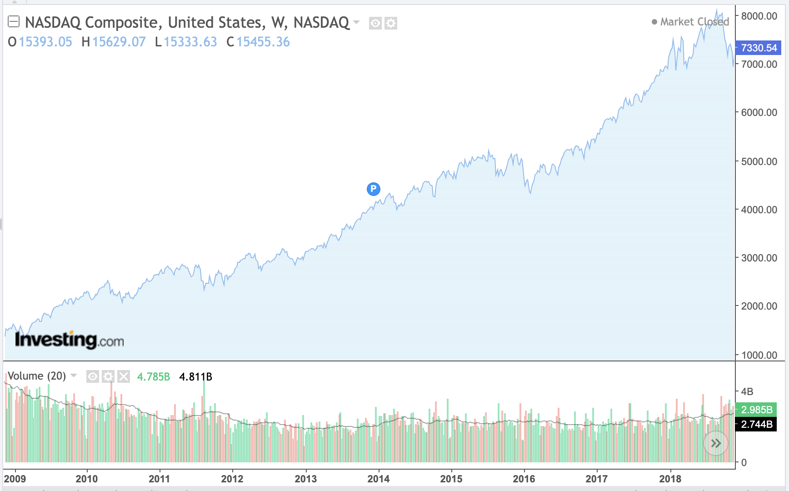
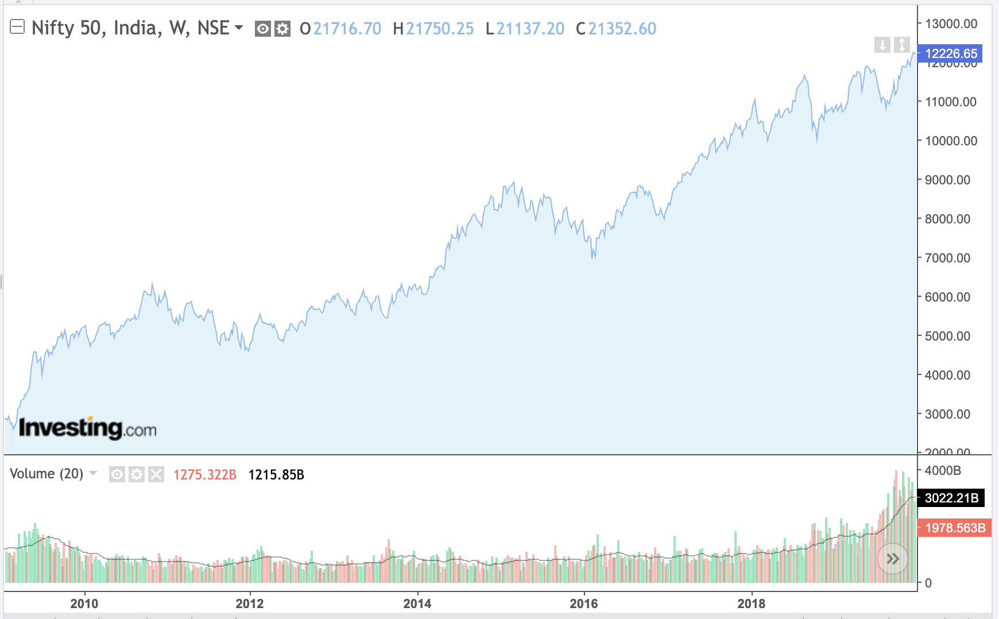
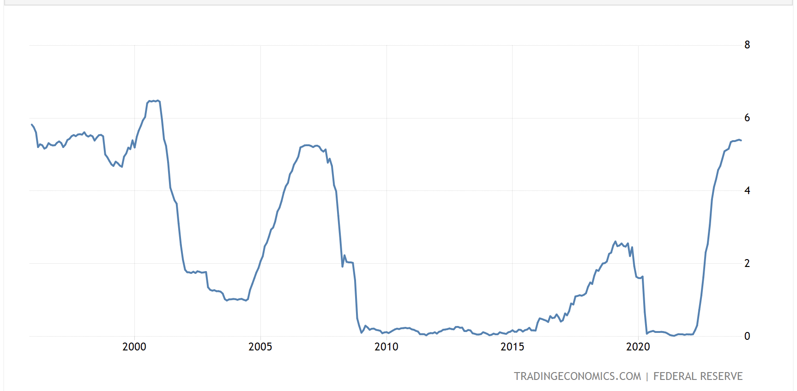
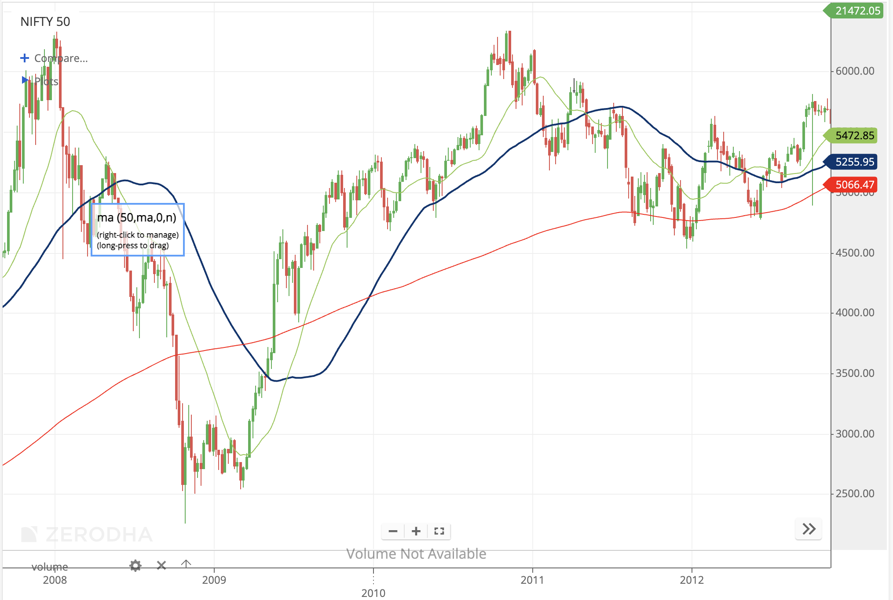

# Stockmarketprediction

I created this project for my Research Methodologies course at Lakehead University, where I developed a portal to assist with stock market investment decisions. The portal classifies the **Nifty 50 index** and its underlying equities into simple **Buy**, **Sell**, and **Hold** categories based on stock prices, macroeconomic indicators, and technical trend signals.

The core idea behind the project came from my hypothesis that the **Nifty 50 often reacts to broader global market movements with a lag**, especially movements in the **NASDAQ Composite**. Since the U.S. market strongly influences global liquidity, investor confidence, technology sentiment, and risk appetite, I wanted to test whether U.S. market signals and interest-rate movement could help identify better entry and exit points in the Indian equity market.

The image below shows the UI of the portal.

---

## Core Concept

The project combines two main ideas:

1. **Macroeconomic signal capture**
2. **MACD-based entry and exit confirmation**

Instead of only looking at historical stock prices, the project also considers wider economic signals such as U.S. interest rates and global index movement. Stock markets do not move in isolation. Interest rates affect borrowing costs, liquidity, investor confidence, company valuations, and the flow of capital between countries.

When interest rates rise, borrowing becomes more expensive and liquidity usually tightens. This can reduce business expansion, lower consumer spending, and put pressure on stock valuations. When rates fall, liquidity usually improves, and investors may become more willing to take risk.

In this project, I used U.S. Federal Funds / repo-rate data along with Nifty 50 and NASDAQ data to explore whether macroeconomic conditions could help identify weak market phases, recession-like periods, or better long-term buying opportunities.

---

## Why Macroeconomics Matters

Macroeconomics studies the larger economy, including interest rates, inflation, GDP growth, employment, liquidity, and financial conditions. These factors affect how investors value companies and how much risk they are willing to take.

For example:

* Higher interest rates can reduce liquidity in the market.
* Higher borrowing costs can slow business growth.
* Investors may shift money from equities to safer fixed-income assets.
* Foreign investors may reduce exposure to emerging markets when U.S. rates become more attractive.
* Tight financial conditions can act as an early warning sign before market weakness or recession-like phases.

This project uses that idea as a starting point. The goal was not to predict a crash with certainty, but to add a macroeconomic layer that could support better investment timing.

The Nifty 50 has historically delivered strong long-term returns, with the project research noting around **14.5% CAGR over a 10-year period**. This project was an attempt to go one step further by identifying better **Buy**, **Hold**, and **Sell** points instead of relying only on passive index investing.

---

## NASDAQ and Nifty 50 Relationship

One of the main hypotheses behind this project was that the **Nifty 50 lags the NASDAQ Composite by roughly two years**. I explored this through correlation and cross-correlation analysis.

The reasoning was that the NASDAQ often reflects global technology sentiment, liquidity conditions, and investor risk appetite. Since global market sentiment can later spill over into emerging markets, I tested whether NASDAQ movement could act as a leading signal for the Nifty 50.

---

## Interest Rates and Market Movement

Interest rates are one of the most important macroeconomic signals because they influence how money moves through the economy.

When central banks increase rates:

* Borrowing becomes expensive.
* Businesses may reduce investment.
* Consumers may reduce spending.
* Investors may move toward safer assets.
* Equity valuations may come under pressure.

When central banks reduce rates:

* Borrowing becomes cheaper.
* Liquidity improves.
* Investors may take more risk.
* Equity markets may become more attractive.

This is why repo-rate and federal funds-rate data were used in this project. The model was designed to test whether changing interest-rate conditions could improve the quality of Buy/Sell/Hold classification for the Nifty 50.

---

## MACD Strategy

Along with macroeconomic signals, I integrated **MACD** logic to add a technical confirmation layer.

MACD stands for **Moving Average Convergence Divergence**. It is commonly used to identify momentum shifts and possible entry or exit points by comparing short-term and long-term moving averages.

In this project, MACD was used to support the final decision logic. The idea was that a Buy or Sell signal becomes more useful when both the macro/model signal and the trend direction support the same decision.

---

## Machine Learning Approach

The project tested multiple approaches, including:

* LSTM neural networks
* Facebook Prophet
* Random Forest classification

The final direction shifted toward classification because **Buy / Sell / Hold** signals are more useful for this project than predicting an exact future price. Instead of trying to forecast the next index value, the project focused on translating market and macroeconomic conditions into a simple decision category.

The final target classes were:

* `1` = Buy
* `0` = Hold
* `-1` = Sell

---

## Project Workflow

The workflow of the project was:

1. Collected historical Nifty 50 data.
2. Collected NASDAQ Composite data.
3. Collected U.S. Federal Funds / repo-rate data.
4. Aligned all datasets into a common time-series format.
5. Explored the relationship between NASDAQ, Nifty 50, and interest-rate movement.
6. Created a custom Buy/Sell/Hold target variable.
7. Tested different forecasting and classification approaches.
8. Selected classification as the final direction.
9. Added MACD-style trend confirmation.
10. Built a Flask backend to serve predictions.
11. Built a React frontend to display the results.

---

## Dashboard

The backend runs on **Flask** and fetches data from a pretrained machine learning model to classify stocks into **Buy**, **Sell**, and **Hold** categories.

The frontend is built with **React** and displays the prediction output in a simple dashboard format. The dashboard was designed to reduce manual chart review by bringing the model output, index status, and stock-level signals into one interface.

At launch, the dashboard covered:

* Nifty 50 index view through NIFTYBEES
* 50 Nifty constituent stocks

This gave coverage for around **51 Nifty-linked instruments**.

---

## Technologies Used

* Python
* pandas
* NumPy
* scikit-learn
* TensorFlow / Keras
* Facebook Prophet
* Flask
* React
* Alpha Vantage API
* Yahoo Finance / historical market data
* Matplotlib
* Seaborn

---

## Purpose

This project was built as a research prototype to explore whether macroeconomic indicators and MACD-based technical confirmation can improve stock-market decision support.

The goal was not to create a guaranteed trading system. The goal was to test whether a combination of:

* Nifty 50 price movement
* NASDAQ movement
* U.S. interest-rate data
* macroeconomic context
* MACD-style confirmation
* machine learning classification

could provide better Buy/Sell/Hold signals for long-term investment decisions.

---

## References

* Nifty Indices — Nifty 50 official index information: https://www.niftyindices.com/indices/equity/broad-based-indices/nifty--50
* Federal Reserve — Monetary Policy explanation: https://www.federalreserve.gov/aboutthefed/fedexplained/monetary-policy.htm
* IMF — Monetary Policy and how interest rates affect the economy: https://www.imf.org/en/publications/fandd/issues/series/back-to-basics/monetary-policy
* Alpha Vantage API Documentation: https://www.alphavantage.co/documentation/
* Investopedia — MACD explanation: https://www.investopedia.com/terms/m/macd.asp
